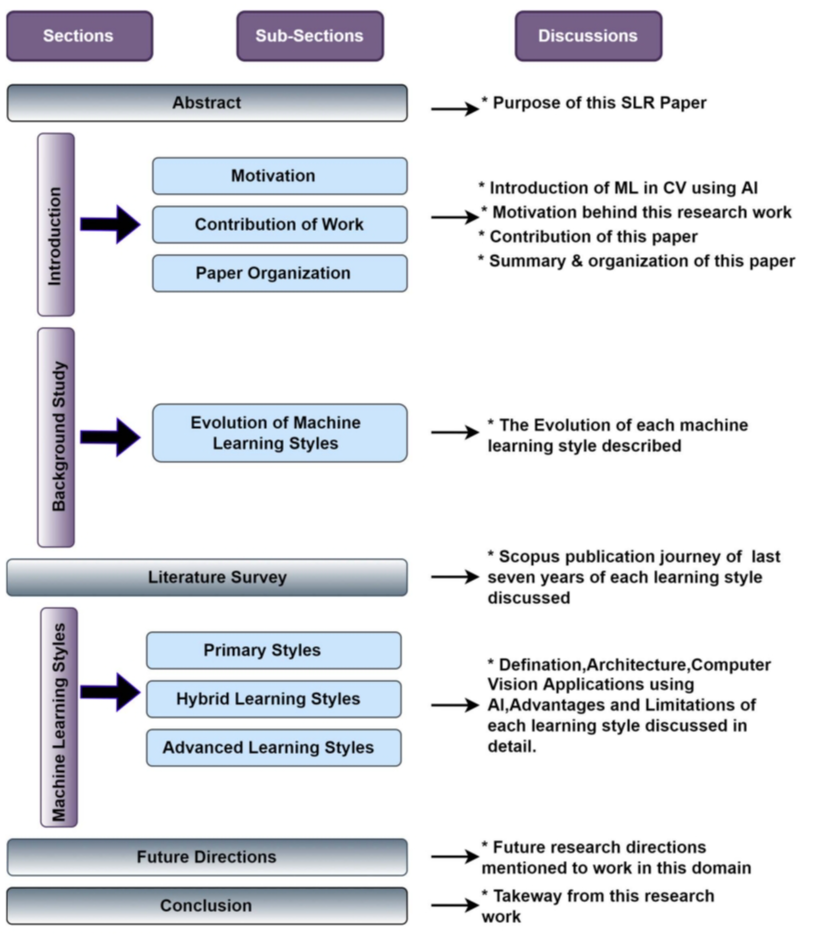
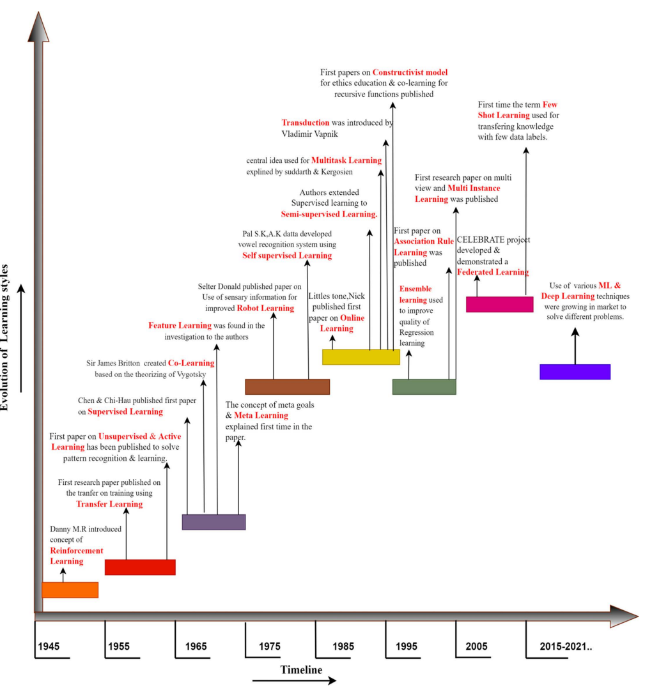
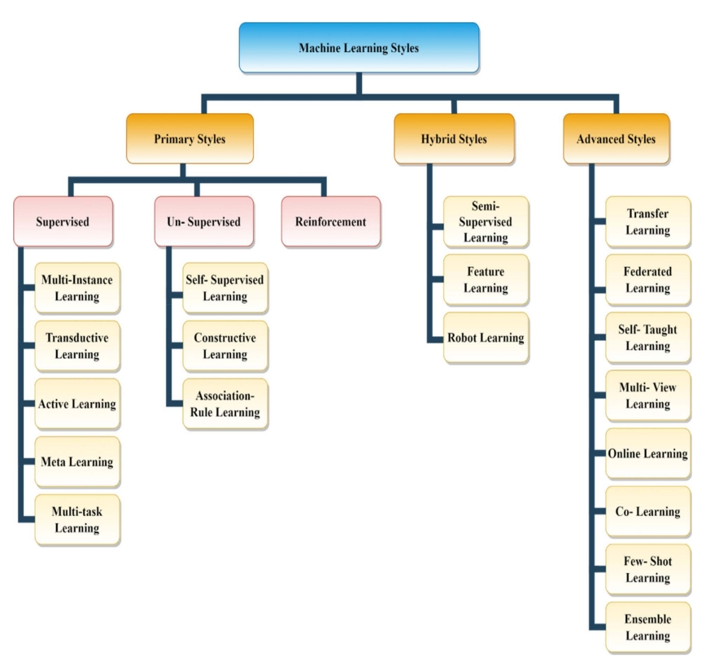
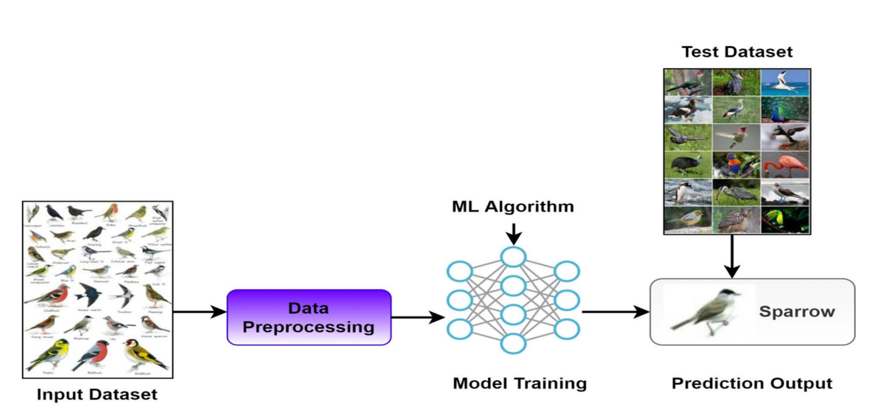

# 摘要

## 英文原文

Computer applications have considerably shifted from single data processing to
machine learning in recent years due to the accessibility and availability of
massive volumes of data obtained through the internet and various sources. 
Machine learning is automating human assistance by training an algorithm on 
relevant data. Supervised, Unsupervised, and Reinforcement Learning are the three
fundamental categories of machine learning techniques. In this paper, we have 
discussed the different learning styles used in the field of Computer vision, 
Deep Learning, Neural networks, and machine learning. Some of the most recent 
applications of machine learning in computer vision include object identification,
object classification, and extracting usable information from images, graphic 
documents, and videos. Some machine learning techniques frequently include 
zero-shot learning, active learning, contrastive learning, self-supervised 
learning, life-long learning, semi-supervised learning, ensemble learning, 
sequential learning, and multi-view learning used in computer vision until now. 
There is a lack of systematic reviews about all learning styles. This paper
presents literature analysis of how different machine learning styles evolved in
the field of Artificial Intelligence (AI) for computer vision. This research 
examines and evaluates machine learning applications in computer vision and future forecasting. This paper will be helpful for researchers working with learning 
styles as it gives a deep insight into future directions.

## 翻译

近年来，由于通过互联网和各种来源获得的大量数据的可访问性和可用性，计算机应用已经
从单一数据处理大幅转向机器学习。机器学习通过在相关数据上训练算法来实现人类协助的
自动化。监督学习、无监督学习和强化学习是机器学习技术的三个基本类别。在本文中，我
们讨论了计算机视觉、深度学习、神经网络和机器学习领域中使用的不同学习风格。机器学
习在计算机视觉中的一些最新应用包括对象识别、对象分类以及从图像、图形文档和视频中
提取可用信息。一些直到目前被使用的机器学习技术通常包括零样本学习、主动学习、对比
学习、自监督学习、终身学习、半监督学习、集成学习、顺序学习和多视图学习等。(目前)
缺乏对所有学习方式的系统评估。本文呈现了计算机视觉方面人工智能(AI)领域中不同的机
器学习风格是如何演变的文献分析。本研究考察和评估机器学习在计算机视觉和未来预测中
的应用。这篇论文将有助于研究(机器)学习风格的研究人员，因为它对未来的发展方向有深
刻的见解。

# 文章信息

1. Author: Mahadevkar, V, Supriya and Khemani, Bharti and Patil, Shruti and Kotecha, 
Ketan and Vora, Deepali R. and Abraham, Ajith and Gabralla,Lubna Abdelkareim   
2. Title: A Review on Machine Learning Styles in Computer Vision-Techniques and Future Directions  
3. Journal: IEEE ACCESS  

# 文章框架

```{r, outlineofpapers, fig.cap = "Outline of papers", echo=FALSE, fig.align='center'}

```

# 文章观点

1.机器学习是一种人工智能(AI)，它通过学习和扩展以前的经验来训练计算机像人类一样思考。

2.对于数据的预测和分析任务，机器学习分为三种类型：监督学习、无监督学习和半监督学习。

3.计算机视觉的应用领域、相应的机器学习方式和(Python)程序实现库：
```{r, AIincomputervision, fig.cap = "AI in computervision", echo=FALSE, fig.align='center'}
knitr::include_graphics("images/AIincomputervision.png")
```
4. 每种机器学习方式的演变发展史：
```{r, evolutionML, fig.cap = "Evolution of machine learning styles", echo=FALSE, fig.align='center',fig.subcap='a brief history of machine learning styles'}

```
5. 机器学习风格分类：
```{r, MLtaxonomy, fig.cap = "Taxonomy of machine learning styles classification", echo=FALSE, fig.align='center'}

```

# 各机器学习风格基本思想

## Primary Styles

文章此处进一步分为了Supervised, Unsupervised, Reinforcement三种类别。

### Supervised Learning

监督学习的机器学习任务是将每个输入项转换为所需的类标签值。监督学习大致分为两类，
即分类和回归。监督学习的流程流如fig \@ref(fig:supervised) 所示，其输入是经过特征
提取的有标签数据，随后训练模型。训练后的模型将应用于测试数据集来预测结果。性能精
度通过比较预测和实际输出来计算得到。
```{r, supervised, fig.cap = "Framework of supervised learning", echo=FALSE, fig.align='center'}

```
监督学习的优点： 

1. 监督学习给出的分类结果比无监督学习的更加准确。
2. 用有标签数据集去训练和测试模型是容易。

监督学习的缺点：

1. 训练数据缺失。
2. 数据质量低。
3. 对于训练数据欠拟合或过度拟合。
4. 机器学习的过程是复杂的。

#### Multiple Instance Learning

MIL是一种缺乏监督的学习形式，其中训练样本被收集到bag中，并为整个bag而不是特定案
例(instance)提供标签。fig \@ref(fig:MIL) 展示了MIL训练阶段的框架。

```{r, MIL, fig.cap = "Framework of multiple instance learning", echo=FALSE, fig.align='center'}

```

MIL常假设正instance和负instance分别独立地从正instance分布和负instance分布
中采样，然而这并不符合现实世界的情况。例如以下两种情况：

1. Similarities Within the Bag;
2. Co-Occurrence of instances;  
3. Instance and Bag Structure.[^1]

[^1]: 注意此处并非来自论文原本，具体来自知乎：<https://zhuanlan.zhihu.com/p/299819082>.

MIL的优点：

1. MIL深度神经网络能够学习最优地表示给定训练数据的特征；
2. 分类性能较差。

MIL的缺点：

1. 池化函数是提前定义的且不可训练；
2. 超参数r是全局的，因此，它不适应新的instance。

### Reinforcement Learning


