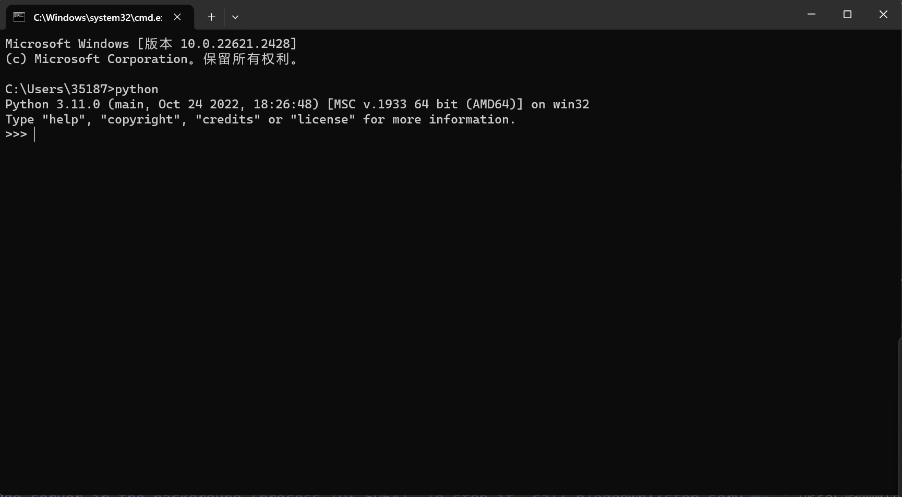
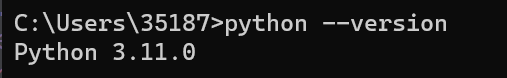
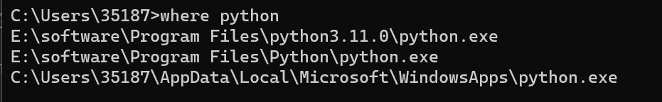
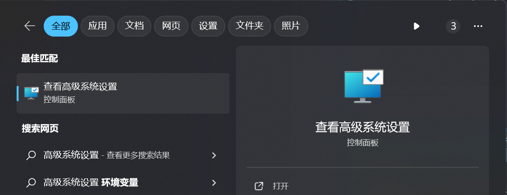
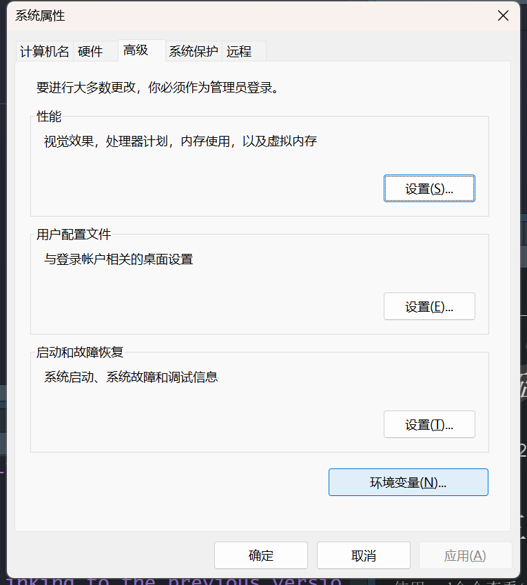
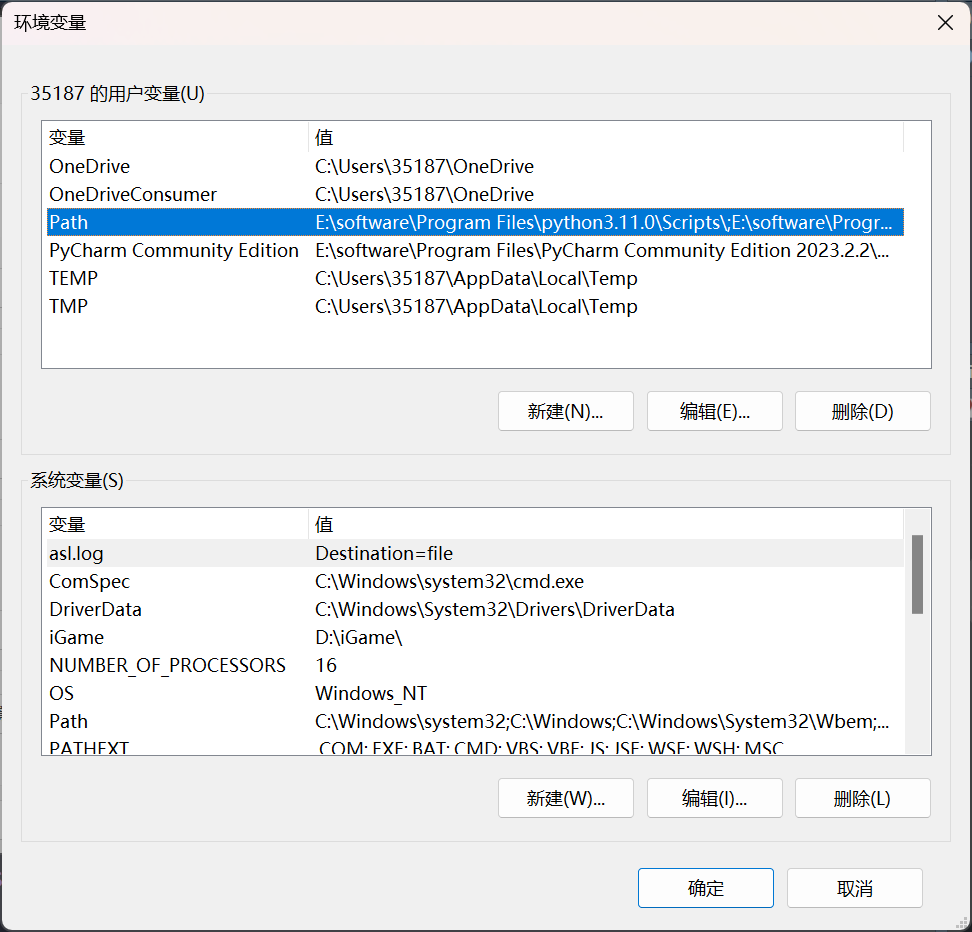
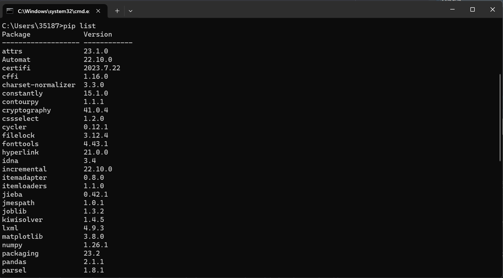
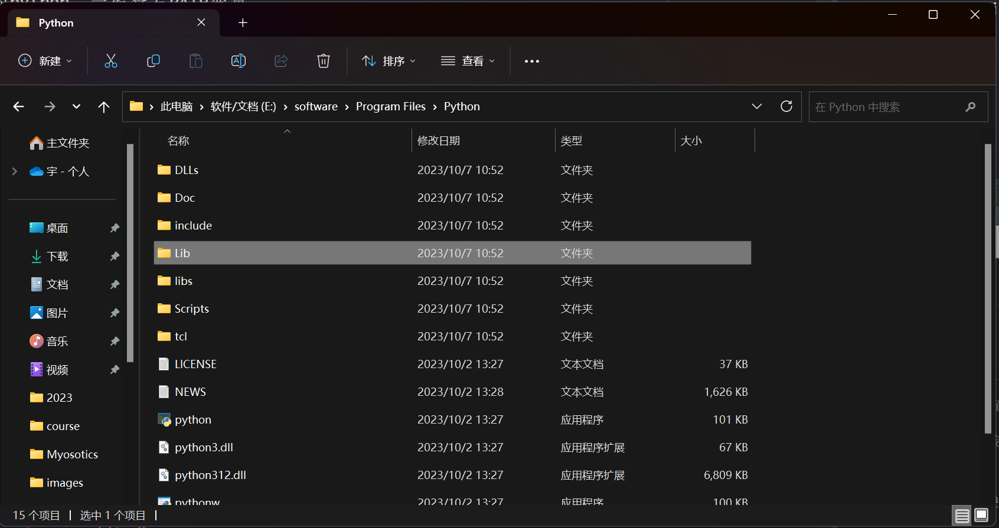
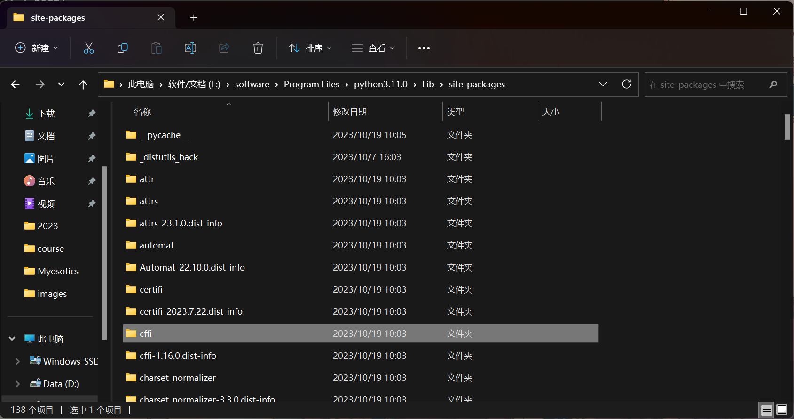

# 版本查看

## 查看python版本

使用cmd命令查看(只能查看默认环境变量的python)。  
输入`win + r`进入命令窗口。输入`python`即可查看默认的 python 版本。

或者输入`python --version`命令进行查看

## 查看python的路径

在命令窗口中输入`where python`，它会显示python对应的路径，多个版本会显示多个路径

## 默认的python版本就是cmd进入的python

首先查看高级系统设置并进入环境变量页面

查看环境变量的python。一般查看PATH变量。

# 第三方库操作

## 查看第三方库

### 使用cmd命令查看(只能查看默认环境变量的python)

输入`win + r`进入命令窗口。输入`pip list`即可查看安装的第三方库。

### 通过安装的路径来看python的包

在命令窗口中输入`where python`，它会显示python对应的路径，多个版本会显示多个路径。

复制进入对应python.exe的的上一级文件，此处我进入的是：`E:\software\Program Files\Python`

之后一般第三方库的路径实在`.\Lib\site-packages`中。

