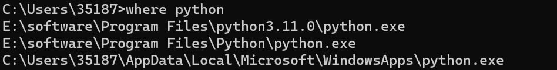

在`Rmarkdown`中调用`Python`代码块需要用到`reticulate`包

```r
install.packages("reticulate")
```
在我们运行python代码块之前首先需要设置好Python环境。下面我们需要指定`Python`路径，
在命令窗口输入`where python`看`python`的路径

接下来在`R`中指定`Pyrhon`路径

```r
library(reticulate)
use_python('E:/software/Program Files/python3.11.0')
```
最后即可在`Rmarkdown`中运行python代码块了

```python
import numpy as np
import matplotlib.pyplot as plt
# 计算正弦曲线上的 x 和 y 坐标
x = np.arange(0, 3*np.pi, 0.1)
y = np.sin(x)
plt.title('sine wave form')
# 使用 matplotlib 来绘制点
plt.plot(x, y)
plt.show()
```

}}index_files/figure-html/unnamed-chunk-3-1.png" width="672" />


