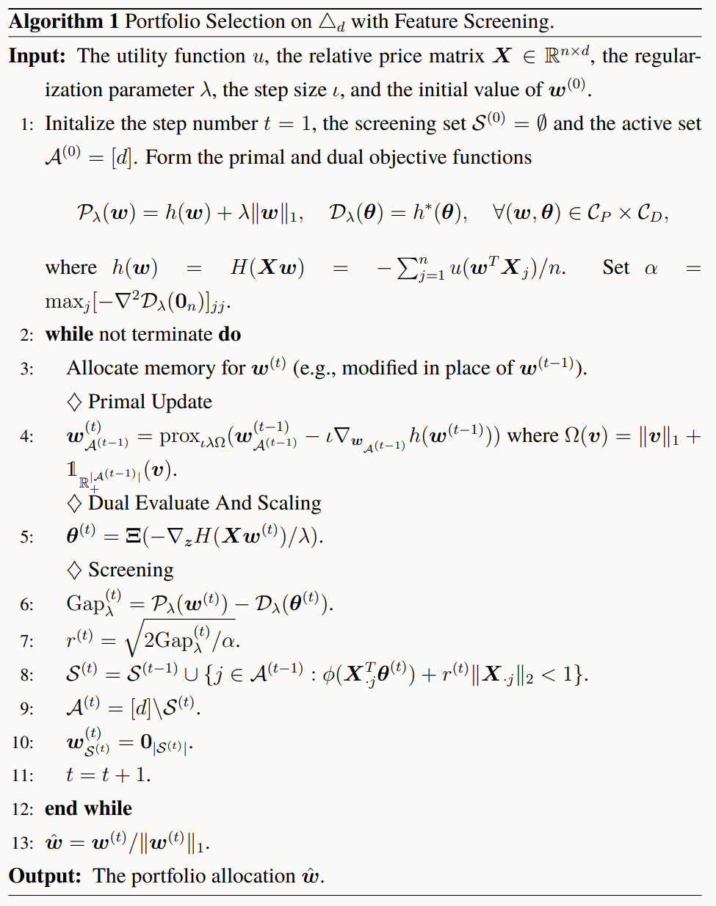

算法和代码均来自文章：Jin-Hong Du, Yifeng Guo & Xueqin Wang (2023) High-Dimensional Portfolio
Selection with Cardinality Constraints, Journal of the American Statistical Association, 118:542, 779-791, DOI: 10.1080/01621459.2022.2133718.

首先加載`reticulate`包，方便在`Rmarkdown`中使用`Python`。
```{r}
library(reticulate)
use_python('E:/software/Program Files/python3.11.0')
```

# 一个小测试

构建一个数据集用来测试
```{python}
import numpy as np
n = 20
d = 100
np.random.seed(0)
X = np.random.rand(n,d) + 0.5
X.shape
from spo import spo_l1_path
ws, lambdas, gaps, n_iters, n_active_features = spo_l1_path(X, func=0,
    n_lambdas=50, screen=True, max_iter=int(1e4), f=200, tol=1e-3)
```

# 算法框架



